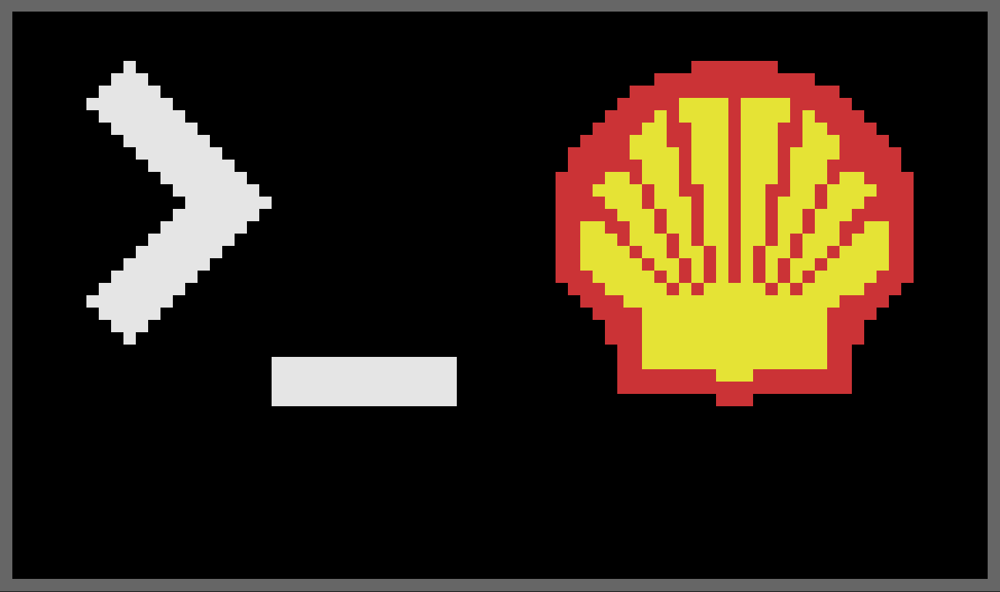
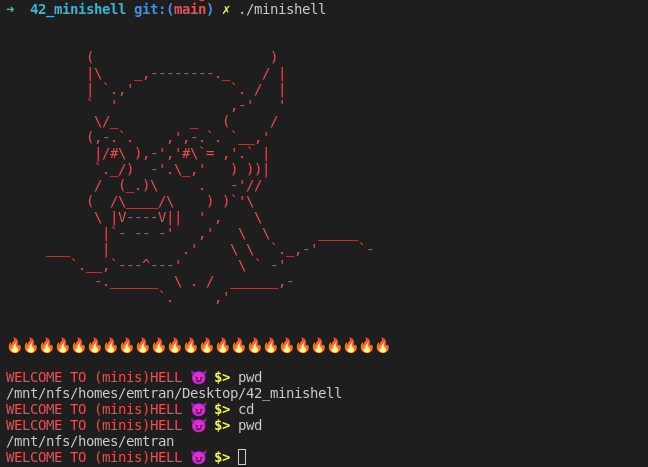

# Minishell of the Hell
```
Yo Pierre you want to come out here?

Yeah, a shell
Yeah, whole lot of shells
Yeah yeah, slime he hell ✝️❤️‍🔥
```


Le projet de Minishell est simple : reproduire certains comportements de base de Bash !
On ne voit pas trop l'intérêt de réaliser ce projet mais ca permet au moins de comprendre comment Bash fonctionne et comment l'implémenter.

```
Notre connaissance est partielle, et partielles sont nos prophéties. 
Mais le jour où notre Minishell apparaîtra, ce qui est partiel cessera. 
                                                                            (Corinthiens 13:9.5) 
```



## MAIS CA DOIT REPRODUIRE QUOI CONCRETEMENT ??? 🕯

Notre Shell doit reproduire plusieurs choses :
* Afficher un **prompt** lorsqu'il attend une nouvelle commande
* Implémenter un **historique** des commandes
* Gérer les **guillemets** (quotes) : les simples et les doubles
* Implémenter les **redirections** : <, >, <<, >>
* Implémenter les **pipes** : |
* Manipuler les **variables d'environnement** ($)
* Gérer les **$?** et les états de sortie
* Gérer les **signaux** : ctrl-C, ctrl-D, ctrl-\
* Gérer des **built-ins** : *echo* (avec -n), *cd* (seulement avec chemin relatif ou absolu), *pwd* (sans option), *export* (sans option), *unset* (sans option), *env* (sans option, ni argument), *exit* (sans option)

## MAIS ON FAIT COMMENT POUR TESTER SI LE MINISHELL MARCHE BIEN ??? 🕯

Pour savoir et tester si notre Shell fonctionne bien, on s'est basé sur les comportements de la norme de Bash POSIX et nous avons établi un tableau de tests pour bien observer si notre Minishell se comporte bien. Evidemment, **libre a chacun de vouloir traiter ou non certaines commandes, qui peuvent être sujettes a débat dans la compréhension du sujet** (gestion du tilde pour cd, les bonus, les sorties d'erreur, l'absence d'environnement au lancement du Minishell, etc.).
Et évidemment aussi : il se peut qu'il y ait *des erreurs* dans le document. N'hésitez pas a me contacter si vous en trouvez !

### NOTRE SAINTE-BIBLE TANT CONVOITEE ✝️ : 

https://docs.google.com/spreadsheets/d/1uJHQu0VPsjjBkR4hxOeCMEt3AOM1Hp_SmUzPFhAH-nA/edit#gid=0

## MAIS ON FAIT COMMENT POUR COMPRENDRE LES COMPORTEMENTS DU SHELL ??? CA N'A AUCUN SENS... 🕯

Des documents en ligne existent et décrivent comment fonctionne Bash. Certains paragraphes sont a lire absolument pour comprendre son comportement et comment pouvoir le reproduire : 

### LES RECITS DES ACTES DES APÔTRES ✝️ :

* https://www.gnu.org/software/bash/manual/bash.html
* https://pubs.opengroup.org/onlinepubs/9699919799/
* https://www.cs.purdue.edu/homes/grr/SystemsProgrammingBook/Book/Chapter5-WritingYourOwnShell.pdf
* https://catonmat.net/bash-one-liners-explained-part-three
* https://brennan.io/2015/01/16/write-a-shell-in-c/
